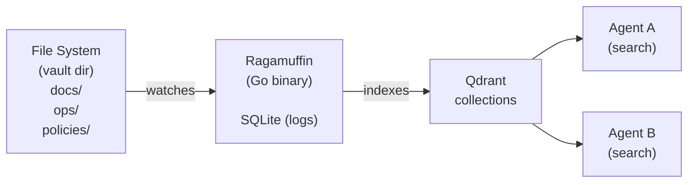
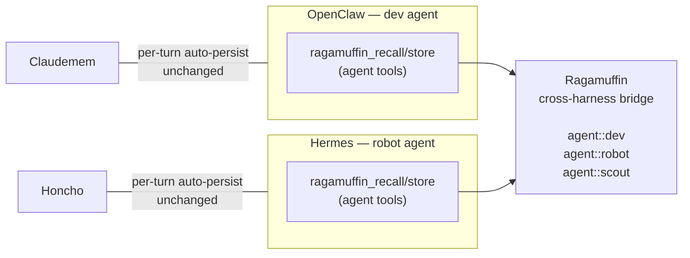
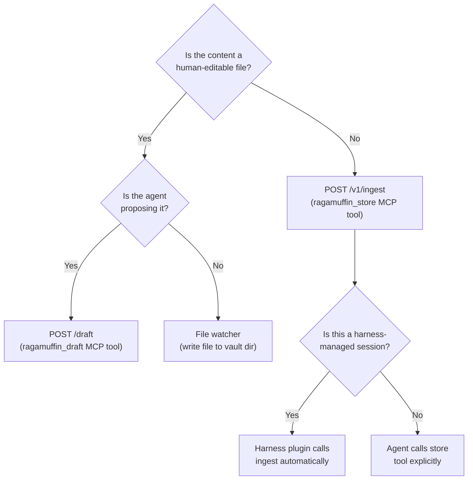

# 🧣 ragamuffin

Ragamuffin is an **open-source knowledge server for AI agents.** Point it at a directory of markdown files. It indexes everything into vector search. Your agents get instant semantic recall over your institutional knowledge.

No vector database to manage. No pipeline to build. No agent discipline required.

[](https://github.com/chezgoulet/ragamuffin/actions/workflows/build.yml)

```bash
# Point Ragamuffin at your docs. Ask anything.
curl -s http://localhost:8000/recall \
  -d '{"query":"what should I know about this project?"}'
```

**What makes this different:** we bet our own infrastructure on it. Every agent in the [Chez Goulet](https://chezgoulet.org) system — real agents answering real questions every day — runs on this single binary. The same code that powers production is the code you download. Benchmark results are published alongside each release. The bugs we find get filed as open issues and fixed.

**One Docker command.** No separate enterprise version and open-source version. There's one binary.

```bash
docker run -d -p 8000:8000 \
  -v /path/to/docs:/opt/vault:ro \
  -e RAGAMUFFIN_VAULT_PATH=/opt/vault \
  -e RAGAMUFFIN_QDRANT_URL=http://host.docker.internal:6334 \
  -e RAGAMUFFIN_EMBEDDING_API_KEY=sk-... \
  chezgoulet/ragamuffin:latest
```

> *noun.* A person, typically a child, in ragged, dirty clothes. In our case: a scrappy little knowledge tool that agents can actually use.

> See the [full architecture](#two-patterns), [API reference](docs/reference-agent/api-reference.md), or jump to [Quick Start (Development)](#quick-start-development).

---

## Quick Start (Development)

### Prerequisites

- **Go 1.25+** (`go version`)
- **Qdrant** running locally (`docker run -d -p 6334:6334 qdrant/qdrant`)
- **Embedding API key** (OpenAI or compatible — `text-embedding-3-small` by default)

### Build from Source

```bash
git clone https://github.com/chezgoulet/ragamuffin.git
cd ragamuffin
go build -o ragamuffin ./cmd/ragamuffin
```

### Run Locally

```bash
# Set minimum config (embedding API key is optional — omit to run without /recall)
export RAGAMUFFIN_VAULT_PATH=./test-vault
export RAGAMUFFIN_QDRANT_URL=http://localhost:6334
export RAGAMUFFIN_EMBEDDING_API_KEY=sk-...

# Create a vault dir with some content
mkdir -p ./test-vault
echo '# Hello' > ./test-vault/index.md

# Start
./ragamuffin
```

### Run Tests

```bash
# Unit tests (no external dependencies)
go test ./internal/... -short

# Integration tests (require Qdrant + API keys — skipped by default)
go test ./... -run Integration -v
```

> **Note:** Integration tests are tagged `t.Skip()` by default and require
> explicit environment setup. Unit tests cover auth, chunking, config,
> events, LLM client, embedding client, Qdrant client, rate limiting,
> server handlers, and the indexer manager. The pruner package has no
> integration tests — testing is via the review queue API end-to-end.

## Branch Workflow

Ragamuffin uses a **staged-branch workflow** with three tiers:

```
┌──────────┐    PR    ┌──────────┐    PR    ┌──────────┐
│  dev/*    │ ──────→  │ testing  │ ──────→  │   main   │
│ branches  │          │ (staging)│          │ (stable) │
└──────────┘          └──────────┘          └──────────┘
     │                      │                     │
     │ go test + vet        │ testing-push.yml    │ build.yml
     │ (PR check)           │ Docker :rolling     │ Docker :latest+version tag
     ▼                      ▼                     ▼
 CI passes             Deploy for val.      Tag & release
```

**Tier 1 — Feature branches (`dev/*`)**
Branch from `testing`, PR into `testing`. Every PR triggers `pr-check.yml`
(compile, test, vet). Must pass before merge.

**Tier 2 — `testing` branch**
The integration branch. Merges trigger `testing-push.yml` which builds and
pushes the `:rolling` Docker tag. This is where changes validate before
reaching production.

**Tier 3 — `main` branch**
The stable release branch. Tagged releases trigger `build.yml` which
runs quality gates (format, vet, tests), builds Docker `:latest` +
version tags, cross-compiles binaries, and cuts a GitHub release.
Only release PRs from testing to main land here.

> See [docs/ARCHITECTURE.md](docs/ARCHITECTURE.md) for the full CI pipeline
> walkthrough and [CONTRIBUTING.md](CONTRIBUTING.md) for how to open a PR.

---

## Two Patterns

Ragamuffin serves two distinct use cases. They can be used independently or together.

### Pattern 1: Vault Knowledge Server

Point Ragamuffin at a filesystem directory. It watches for changes (poll or inotify),
chunks files, embeds them, and indexes into Qdrant. Agents search the vault with
natural language queries. Optional LLM-backed answer synthesis.



**Who this is for:** Teams that want agents to search shared documentation,
runbooks, policies, or codebases — any directory of files that needs to be
queryable by natural language.

### Pattern 2: Agent Memory Backend

Plug Ragamuffin into your agent harness (OpenClaw or Hermes) via a memory
plugin adapter. Every agent gets its own isolated Qdrant collection, persistent
session memory, and cross-agent recall — with zero agent discipline required.
The harness routes memory operations transparently: no `curl`, no tool calls
from the agent itself.

```mermaid
flowchart LR
    OC["OpenClaw<br/>(dev agent)<br/>memory-ragamuffin plugin"]
    H["Hermes<br/>(robot agent)<br/>memory-ragamuffin plugin"]
    R["Ragamuffin"]
    Q1["Qdrant<br/>agent::dev"]
    Q2["Qdrant<br/>agent::robot"]

    OC -->|POST /v1/ingest| R
    H -->|POST /vault/{name}/recall| R
    R -->|POST /vault/{name}/recall?<br/>vault=agent::robot| R
    R --> Q1
    R --> Q2

    subgraph Q1 [agent::dev]
        D1A[session turns]
        D1B[recalled facts]
        D1C[summaries]
    end

    subgraph Q2 [agent::robot]
        D2A[session turns]
        D2B[recalled facts]
        D2C[summaries]
    end
```

**Who this is for:** Operators running multi-agent systems who need:
- **Guaranteed persistence** — the harness enforces memory writes, agents don't
  have to remember to call a tool
- **Per-agent isolation** — each agent's Qdrant collection is physically separate;
  metadata filter bugs can't leak data across agents
- **Cross-agent recall** — agent A can query agent B's memory via `agent_recall`
  (privileged tool provided by the harness)
- **Single infrastructure** — one Ragamuffin instance, one Qdrant cluster, all agents

### Side-by-side

| Dimension | Vault Knowledge Server | Agent Memory Backend |
|---|---|---|
| Data source | Filesystem directory | Session turn content from harness |
| Isolation | Per-vault Qdrant collections | Per-agent Qdrant collections (`agent::<name>`) |
| Agent setup | Curl / MCP from any agent | Plugin adapter installed in harness |
| Persistence | File watcher detects changes | Harness calls `POST /v1/ingest` each turn |
| Cross-agent | N/A | Privileged cross-agent recall tool |
| Hardware | One Ragamuffin | One Ragamuffin for all agents |

Both patterns can coexist: file-based vaults for shared knowledge, agent vaults
for session memory, all on the same Ragamuffin instance.

### Hybrid Pattern 3: Ragamuffin as Cross-Harness Bridge

Keep your existing harness memory slots (claudemem in OpenClaw, Honcho in
Hermes) while using Ragamuffin exclusively as a **cross-harness recall bridge**
and **structured fact store**. Agents get two additional tools that call
Ragamuffin's API directly — no plugin swap required.



**Why run this way:**
- Zero migration — your existing memory setup stays exactly as-is
- Cross-harness recall works across the boundary: OpenClaw dev can ask what
  Hermes robot found in the last scan
- Agents write selectively — only important conclusions and shared facts go
  to Ragamuffin, not every turn
- Gentler operational path: validate Ragamuffin in production before committing
  to a full slot swap

**What it costs:**
- No auto-persistence — agents must explicitly call their store tool to write
- No auto-prefetch — Ragamuffin context won't appear in the system prompt
  automatically; agents must use recall when they need it
- Agent discipline is required — if the agent forgets to store something, it's
  lost (mitigated by the existing slot backend catching everything per-turn)

| Dimension | Full plugin (slot) | Hybrid (agent tools) |
|---|---|---|
| Harness slot | Swap to memory-ragamuffin | Keep claudemem/Honcho |
| Turn persistence | Automatic | Slot handles this |
| Cross-harness recall | Built-in | Via ragamuffin_recall tool |
| Agent writes | Zero-touch | Explicit tool calls |
| Migration risk | Swap and validate | Additive, zero-risk |
| End state | Full Ragamuffin | Ragamuffin as bridge layer |

All three patterns use the same Ragamuffin instance and the same per-agent
Qdrant collections. The difference is who calls the API — the harness plugin
or the agent itself.

---

## Write-Back Paths

Ragamuffin has three ways to write knowledge into a vault. They have different
latency profiles and are designed for different use cases:

| Path | Interface | Latency | Best For |
|---|---|---|---|
| File watcher | filesystem | seconds to minutes | Human-edited vault files |
| `POST /draft` / `ragamuffin_draft` | REST / MCP | near-real-time | Agent-proposed file edits |
| `POST /v1/ingest` / `ragamuffin_store` | REST / MCP | near-real-time | Agent-originated signals, observations |

### Path 1: File Watcher (Pattern 1)

The watcher polls or uses inotify to detect changes in a vault directory
(`ragamuffin.roots` in config). When a file is created, modified, or deleted,
the watcher re-chunks and re-embeds the affected content into the vault's
Qdrant collection.

**Use when:** A human is editing markdown files, runbooks, policies, or
documentation. The vault is the source of truth; Ragamuffin is the index.

**Don't use for:** Agent-generated signals, per-turn session content, or any
write that needs to survive a container restart without a filesystem. If the
watcher isn't the writer, you're adding latency and complexity.

### Path 2: `POST /draft` — Agent-Proposed File Edits (MCP: `ragamuffin_draft`)

Agents use `POST /draft` to create or update files in the vault. The request
includes the file path and content. Ragamuffin writes the file, and the
watcher picks it up on the next poll, chunks + indexes it.

**Use when:** An agent needs to write a document, update a runbook, or create
an artifact that should live in the filesystem vault. The agent proposes
content; Ragamuffin makes it real.

**Best practice:** Include a meaningful `source` in the request so downstream
consumers know who wrote it — e.g. `agent:news-digest` or `human:christopher`.
See [Source Labeling](#source-labeling) below.

### Path 3: `POST /v1/ingest` — Agent-Oriented Signals (MCP: `ragamuffin_store`)

Agents send structured documents (JSON with text + metadata) directly to the
vault, bypassing the filesystem entirely. The data goes straight into Qdrant
via the indexer event pipeline.

**Use when:** An agent wants to persist an observation, a synthesis result,
a log analysis, or any signal that doesn't belong in a file. Common patterns:
- "I learned that X depends on Y" — store as a fact for future recall
- "Scan of production found issue Z" — persist the summary
- Per-turn session memory (Pattern 2 — called by the harness, not the agent)

**Don't use for:** File-level documents that humans should read and edit.
Those go through `/draft` or the file watcher.

### Which Path Should My Client Use?



### Agent Write Discipline

Agents that use `ragamuffin_store` or `ragamuffin_draft` must be explicitly
prompted to write back. Unlike Pattern 2 (harness plugin), the agent decides
*when* and *what* to persist. This means:

- **Prompting matters.** Include a "store important observations" instruction
  in the agent's system prompt, or let the agent decide autonomously based on
  conversation cues.
- **Deduplication is your friend.** Store signals with stable IDs so repeated
  calls are idempotent. Both `/v1/ingest` and `/v1/facts` support this.
- **Don't store everything.** Be selective — storing every turn transcript
  without filtering creates noise. The Pattern 2 harness plugin does this for
  you; if you're on Pattern 3 (hybrid), consider what's actually worth
  persisting.

### Source Labeling

Every write-back path supports a `source` or `source_type` field. Use it
consistently so queries can filter by provenance:

| Label | Meaning |
|---|---|
| `agent:news-digest` | Generated by the news-digest agent |
| `agent:scout` | Intelligence from the scout agent |
| `human:christopher` | Authored by Christopher |
| `human:shannon` | Authored by Shannon |
| `session` | Per-turn auto-persist from harness plugin |

### Real-Time vs. Batch Guidance

| Scenario | Recommended Approach |
|---|---|
| Home Assistant telemetry | n8n-generated summary document on a schedule → `POST /v1/ingest` |
| Agent log lines | Summary via LibreFang agent → `POST /v1/ingest` (not raw line-by-line) |
| Research notes | Agent writes markdown → `POST /draft` → watcher indexes |
| Incident postmortem | Human writes markdown → watcher picks up automatically |

---

## API Reference

### Core RAG Endpoints

#### `POST /recall` — Semantic search

```bash
curl -s http://localhost:8000/recall \
  -H "Content-Type: application/json" \
  -d '{"query":"deployment process","top_k":10,"score_threshold":0.5,"source_filter":"ops/"}'
```

| Field | Type | Default | Description |
|---|---|---|---|
| `query` | string | — | Natural-language search query **(required)** |
| `top_k` | int | 10 | Max results (1–100) |
| `score_threshold` | float | 0.0 | Minimum similarity (0.0–1.0) |
| `source_filter` | string | — | Restrict to files under this path prefix |
| `mode` | string | `auto` | Recall mode: `auto` (classify then recall), `rag` (RAG-only), `full` (load full source files) |
| `time_filter` | string | `active` | Temporal filter: `active` (current index), `active_at:<RFC3339>`, or `all` |

**Response:**
```json
{
  "results": [
    {
      "text": "Deployment uses GitHub Actions...",
      "source_file": "ops/deploy.md",
      "header": "## Deployment",
      "chunk_index": 2,
      "score": 0.89,
      "file_last_updated": "2026-05-10T14:30:00Z"
    }
  ],
  "top_score": 0.89
}
```

#### `POST /ask` — Synthesized answer (requires LLM config)

```bash
curl -s http://localhost:8000/ask \
  -H "Content-Type: application/json" \
  -d '{"query":"What is our deployment strategy?","mode":"auto","top_k":8}'
```

| Field | Type | Default | Description |
|---|---|---|---|
| `query` | string | — | Question to answer **(required)** |
| `mode` | string | `auto` | `rag` (RAG-only), `auto` (RAG→full fallback), or `full` (load full source files) |
| `top_k` | int | 8 | RAG results to retrieve (1–50) |

Returns `mode_used` so callers can see if auto-mode chose RAG or full.

**Additional fields:** same `time_filter` and `source_filter` as `/recall`.

---

### Tiered Recall

Ragamuffin supports three recall modes, controllable per-query via the `mode`
parameter on `/recall`, `/ask`, and their vault-scoped variants:

| Mode | Behavior | When to use |
|---|---|---|
| `rag` | Retrieval-Augmented Generation — always searches the index, returns chunk results, and (for `/ask`) synthesizes an answer from the retrieved chunks | When you know the answer is in the index and want the fastest path |
| `auto` | **Default.** Classifies the query first: if it's a targeted information need, uses `rag`; if it's a broad question needing full context, falls back to `full` | General purpose — lets Ragamuffin decide |
| `full` | Loads entire source files matching the query into the LLM context, skipping chunk-level search | When the question requires understanding the full document (architecture docs, policies) |

The `/ask` response includes `mode_used` so callers can see which mode was
selected by `auto` classification, useful for debugging and observability.

#### `POST /draft` — Write files to the vault

```bash
# Direct mode — writes immediately to the vault filesystem
curl -s http://localhost:8000/draft \
  -H "Content-Type: application/json" \
  -d '{"title":"Database Schema","content":"...","target_path":"ops/schema.md","mode":"direct"}'

# PR mode — opens a git pull request (requires git config)
curl -s http://localhost:8000/draft \
  -H "Content-Type: application/json" \
  -d '{"title":"Update schema","content":"...","target_path":"ops/schema.md","mode":"pr","description":"Add new table"}'

# Delete a file
curl -s http://localhost:8000/draft \
  -H "Content-Type: application/json" \
  -d '{"title":"Delete","target_path":"ops/old.md","mode":"direct","delete":true}'
```

| Field | Type | Default | Description |
|---|---|---|---|
| `title` | string | — | File or PR title **(required)** |
| `content` | string | — | File content (omit or `""` if `delete=true`) |
| `target_path` | string | — | Path relative to vault root **(required)** |
| `mode` | string | `direct` | `direct` or `pr` |
| `description` | string | — | PR body (PR mode only) |
| `delete` | bool | `false` | Delete the file instead of writing |

Security: path traversal is blocked — resolved paths must stay under the vault root.

#### `POST /audit` — Vault health check

```bash
curl -s http://localhost:8000/audit \
  -H "Content-Type: application/json" \
  -d '{"stale_days":90,"checks":["stale","semantic_conflict","gap","duplicate"],"sample_size":50}'
```

| Field | Type | Default | Description |
|---|---|---|---|
| `stale_days` | int | 90 | Days since last update to flag as stale |
| `checks` | array | all | Which audit checks to run: `stale`, `semantic_conflict`, `gap`, `duplicate` (these are audit check names, not review_reasons types — see [review filter](#get-v1review--list-items-needing-attention)) |
| `sample_size` | int | 50 | Chunk pairs to LLM-compare (1–200, requires LLM) |

### Agent Memory Endpoints (v0.6)

These endpoints support the agent memory backend pattern. Harness plugin adapters
call them transparently — agents don't curl these directly. But you can, for
debugging and manual inspection.

#### `POST /vaults` — Create a new runtime vault

Creates a vault on disk at the given path. Only available in multi-tenant mode.

```bash
curl -s -X POST http://localhost:8000/vaults \
  -H "Content-Type: application/json" \
  -d '{"name":"my-app","path":"/data/vaults/my-app"}'
```

| Field | Type | Default | Description |
|---|---|---|---|
| `name` | string | — | Vault name **(required)** — lowercase alphanumeric + hyphens, 1-32 chars |
| `path` | string | — | Absolute filesystem path **(required)** |

**Response:** `HTTP 201 Created`
```json
{
  "name": "my-app",
  "path": "/data/vaults/my-app"
}
```

Returns `409 Conflict` if the vault already exists. For auto-provisioning,
use `POST /v1/ingest` with the `vault` field — the vault will be created
automatically on first ingest.

#### `POST /v1/ingest` — Index content into an agent vault

Persist session content, turn transcripts, or any text into an agent's vault.
Called by the harness plugin after each completed turn.

```bash
curl -s -X POST http://localhost:8000/v1/ingest \
  -H "Content-Type: application/json" \
  -d '{
    "vault": "agent::dev",
    "documents": [
      {
        "id": "turn-2026-05-17-001",
        "text": "User asked about Hermes integration. I explained the MemoryProvider ABC patterns...",
        "metadata": {
          "source": "session",
          "agent": "dev",
          "session_id": "sess_abc123"
        }
      }
    ]
  }'
```

| Field | Type | Default | Description |
|---|---|---|---|
| `vault` | string | — | Target vault name **(required)** |
| `documents` | array | `[]` | List of documents to index **(required)** |
| `documents[].id` | string | — | Unique doc/session ID **(required)** |
| `documents[].text` | string | — | Content text **(required)** |
| `documents[].metadata` | object | `{}` | Optional metadata for filtering |

> **Body size limit:** 10 MB (`MaxBytesReader`). Larger payloads receive
> `413 Request Entity Too Large` with error code `INVALID_REQUEST`.

**Response:**
```json
{
  "indexed": 1,
  "vault": "agent::dev"
}
```

#### `POST /v1/ingest/conversation` — Index a conversation session

Creates or updates a structured conversation session with multiple turns.
Each turn can include user inputs, assistant responses, and metadata.
Sessions are stored in Qdrant and can be searched via `/recall`.

```bash
curl -s -X POST http://localhost:8000/v1/ingest/conversation \
  -H "Content-Type: application/json" \
  -d '{
    "session_id": "sess_abc123",
    "vault": "agent::dev",
    "title": "Hermes integration discussion",
    "agent_id": "dev",
    "turns": [
      {
        "role": "user",
        "text": "How do I configure Hermes?"
      },
      {
        "role": "assistant",
        "text": "Set MEMORY_PROVIDER=memory_ragamuffin in your config..."
      }
    ]
  }'
```

| Field | Type | Default | Description |
|---|---|---|---|
| `session_id` | string | — | Unique session identifier **(required)** |
| `vault` | string | — | Target vault **(required)** |
| `title` | string | — | Optional session title |
| `agent_id` | string | — | Agent identifier |
| `turns` | array | `[]` | List of conversation turns |
| `turns[].role` | string | — | `user` or `assistant` |
| `turns[].text` | string | — | Turn content |
| `auto_extract` | bool | `false` | Enable automatic fact extraction from conversation turns |

**Response:**
```json
{
  "session_id": "sess_abc123",
  "turns": 2
}
```

#### `POST /v1/documents` — Ingest a document with extraction

Index a document into a vault, with optional automatic fact extraction.
Extraction runs asynchronously — the handler returns once the document is
indexed, while extraction continues in a background goroutine.

```bash
curl -s -X POST http://localhost:8000/v1/documents \
  -H "Content-Type: application/json" \
  -d '{
    "content": "Alice is a software engineer who lives in Montreal and enjoys skiing.",
    "source": "notes/alice.md",
    "vault": "default",
    "auto_extract": true,
    "tags": ["profile", "hobbies"]
  }'
```

| Field | Type | Default | Description |
|---|---|---|---|
| `content` | string | — | Document body text **(required)** |
| `source` | string | — | Source identifier (filename or logical name) **(required)** |
| `vault` | string | `default` | Target vault |
| `auto_extract` | bool | `false` | Enable automatic fact extraction from document content |
| `tags` | array | `[]` | Optional tags for metadata filtering |

**Response:**
```json
{
  "status": "ok",
  "vault": "default",
  "source": "notes/alice.md"
}
```

Extraction is powered by the extraction pipeline (`extractor.Enabled()` in config)
and requires both an LLM and embedding client to be configured. When `auto_extract`
is `true`, the document is scanned for extractable facts — structured key-value
pairs with confidence scores, categories, and TTLs.

---

#### `POST /vault/{name}/recall` — Semantic search across vaults

Vault-prefixed recall targets a specific vault by name. Same semantics as `/recall`
but with vault scoping. The vault name is part of the URL path, not the body.

```bash
# Recall from the calling agent's own vault
curl -s -X POST http://localhost:8000/vault/agent::dev/recall \
  -H "Content-Type: application/json" \
  -d '{"query":"what did we decide about Qdrant isolation?","limit":5}'

# Cross-agent recall — query another agent's vault
curl -s -X POST http://localhost:8000/vault/agent::robot/recall \
  -H "Content-Type: application/json" \
  -d '{"query":"what vulnerabilities were found?","limit":3}'
```

| Field | Type | Default | Description |
|---|---|---|---|
| `vault` | string | — | Vault to search **(required)** |
| `query` | string | — | Natural-language query **(required)** |
| `limit` | int | 10 | Max results (1–100) |
| `min_score` | float | 0.0 | Minimum similarity threshold (0.0–1.0) |
| `mode` | string | `auto` | Recall mode: `auto` (classify then recall), `rag` (RAG-only), `full` (load full source files) |
| `time_filter` | string | `active` | Temporal filter: `active` (current index), `active_at:<RFC3339>`, or `all` |

**Response:**
```json
{
  "results": [
    {
      "text": "Use physical Qdrant collection isolation, not metadata filters...",
      "score": 0.89,
      "metadata": {
        "source": "session",
        "agent": "dev",
        "session_id": "sess_abc123"
      }
    }
  ],
  "vault": "agent::dev"
}
```

#### `GET /v1/sessions` — List sessions (placeholder)

#### `GET /v1/sessions` — List sessions

Lists sessions filtered by agent or vault. Returns metadata without turn content.

```bash
# List all sessions for an agent
curl -s "http://localhost:8000/v1/sessions?agent_id=dev&limit=10"

# List sessions for a specific vault
curl -s "http://localhost:8000/v1/sessions?vault=agent::dev&limit=10"
```

**Response:**
```json
{
  "sessions": [{"id": "uuid", "vault": "agent::dev", "agent_id": "dev", "turn_count": 12, "created_at": "...", "updated_at": "..."}],
  "count": 1
}
```

#### `GET /v1/sessions/{id}` — Get a session with turns

Retrieves a session with its turn content.

```bash
curl -s "http://localhost:8000/v1/sessions/<session_id>?turns=50"
```

Returns full session metadata plus up to `turns` (default 50) most recent turns.

#### `POST /v1/sessions` — Create a session

Creates a new conversation session.

```bash
curl -s -X POST http://localhost:8000/v1/sessions \
  -H "Content-Type: application/json" \
  -d '{"agent_id": "dev", "content": "Initial context...", "vault": "agent::dev"}'
```

`agent_id` is required. `vault` defaults to `agent::<agent_id>` if omitted.
`content` is optional — if provided, it becomes the first turn.

#### `POST /v1/sessions/{id}/turns` — Append a turn

Appends a turn to an existing session.

```bash
curl -s -X POST "http://localhost:8000/v1/sessions/<session_id>/turns" \
  -H "Content-Type: application/json" \
  -d '{"content": "User message...", "role": "user"}'
```

`role` can be `user`, `assistant`, or `system` (defaults to `user`).
Max 10 MB per turn.

#### `DELETE /v1/sessions/{id}` — Delete a session

```bash
curl -s -X DELETE "http://localhost:8000/v1/sessions/<session_id>"
```

Returns `{"status": "deleted", "id": "<session_id>"}`.

### Inbox

The inbox is a per-vault append-only message queue for inter-agent
notifications. Endpoints are available globally and vault-prefixed:
- `/inbox`, `/inbox/{id}`
- `/vault/{name}/inbox`, `/vault/{name}/inbox/{id}`

#### `GET /inbox` — List inbox messages

```bash
curl -s "http://localhost:8000/inbox?vault=agent::dev&status=pending&limit=10"
```

| Param | Description | Default |
|---|---|---|
| `vault` | Target vault **(required)** | — |
| `status` | Filter: `pending`, `read`, `archived` | `pending` |
| `limit` | Max results | 50 |
| `before` | Cursor pagination | — |

**Response:**
```json
{
  "messages": [
    {
      "id": "msg_123",
      "from": "robot",
      "subject": "Scan complete",
      "body": "Nightly scan found 3 new issues",
      "status": "pending",
      "created_at": "2026-06-05T03:00:00Z"
    }
  ]
}
```

#### `POST /inbox` — Send an inbox message

```bash
curl -s -X POST http://localhost:8000/inbox \
  -H "Content-Type: application/json" \
  -d '{
    "vault": "agent::dev",
    "from": "robot",
    "subject": "Nightly review",
    "body": "All scans completed. No action needed."
  }'
```

| Field | Description |
|---|---|
| `vault` | Target vault **(required)** |
| `from` | Sender identifier **(required)** |
| `subject` | Short subject line **(required)** |
| `body` | Message body |

**Response:**
```json
{"id": "msg_123", "status": "created"}
```

#### `GET /inbox/{id}` — Read a message

```bash
curl -s "http://localhost:8000/inbox/msg_123?vault=agent::dev"
```

**Response:** Full message object. The message is marked as `read` automatically.

#### `DELETE /inbox/{id}` — Archive a message

```bash
curl -s -X DELETE "http://localhost:8000/inbox/msg_123?vault=agent::dev"
```

**Response:** `{"status": "archived", "id": "msg_123"}`

---

#### `GET /v1/auth/check` — Verify authentication

Confirms the current request has valid authentication credentials. Useful for
clients to test their API key or JWT token without making a data-modifying call.

```bash
curl -s http://localhost:8000/v1/auth/check \
  -H "Authorization: Bearer <token>"
```

**Response (authenticated):**
```json
{
  "authenticated": true,
  "mode": "api_key",
  "access": "read"
}
```

**Response (unauthenticated):** Returns HTTP 401 `FORBIDDEN`.

### Structured Data Endpoints (v0.3)

#### `POST /v1/facts` — Upsert a structured fact

```bash
curl -s -X POST http://localhost:8000/v1/facts \
  -H "Content-Type: application/json" \
  -d '{"key":"deployment/url","value":"https://app.example.com","tags":["prod","staging"]}'
```

| Field | Type | Limits | Description |
|---|---|---|---|
| `key` | string | 1024 bytes | Fact key **(required)** |
| `value` | string | 64 KB | Fact value **(required)** |
| `tags` | array | optional | String tags for filtering |
| `ttl_days` | int | — | Time-to-live in days (0 = never expires, default 0). Pruner **StaleScan** marks expired facts as `needs_review`. |
| `confidence` | float | 0.0–1.0 | Optional confidence score (default 0.9). Pruner **LowConfidenceScan** flags facts below threshold. |
| `supersedes` | string | — | Key of a fact this new fact replaces. Pruner **SupersedeScan** marks the target as `superseded`. |

Key is hashed (SHA-256) → deterministic UUID is used as the Qdrant point ID. Re-inserting the same key upserts.

#### `GET /v1/facts` — Retrieve facts

```bash
# Exact key lookup
curl -s "http://localhost:8000/v1/facts?key=deployment/url"

# Search by prefix (Qdrant full-text token match on fact_key)
curl -s "http://localhost:8000/v1/facts?prefix=deploy"

# Filter by tag
curl -s "http://localhost:8000/v1/facts?tag=prod&prefix=deploy"

# Paginate
curl -s "http://localhost:8000/v1/facts?limit=20"
curl -s "http://localhost:8000/v1/facts?limit=20&before=<next_token>"
```

| Param | Description | Default |
|---|---|---|
| `key` | Exact fact_key match | — |
| `prefix` | Prefix match on fact_key via Qdrant full-text token filter (see note) | — |
| `tag` | Exact tag keyword filter | — |
| `status` | Filter by lifecycle status (active, needs_review, superseded, rejected) | — |
| `limit` | Max results per page (1–1000) | 100 |
| `before` | Cursor from previous response `next_token` | — |

> ⚠️ `prefix=` uses Qdrant's `MatchText` token filter, not string prefix matching.
> A query for `prefix=deploy` matches tokens containing "deploy" (e.g. "deployment/url",
> "re-deploy"). For exact string prefix matching, a Qdrant payload index with a keyword
> tokenizer would be needed.

**Response:**
```json
{
  "entries": [
    {
      "key": "deployment/url",
      "value": "https://app.example.com",
      "tags": ["prod"],
      "status": "active",
      "confidence": 0.9,
      "expires_at": "2026-11-11T12:00:00Z",
      "supersedes": "",
      "updated_at": "2026-05-15T12:00:00Z"
    }
  ],
  "next_token": "uuid-for-next-page"
}
```

#### `DELETE /v1/facts` — Delete a fact

```bash
curl -s -X DELETE "http://localhost:8000/v1/facts?key=deployment/url"
```

| Param | Description |
|---|---|
| `key` | Fact key to delete **(required)** |

#### `PUT /v1/facts` — Update a fact's TTL or status

Update an existing fact's lifecycle fields. The fact `key` is passed as a **query parameter**;
update fields go in the JSON body. Fields not sent are preserved.

```bash
# Update TTL and status
curl -s -X PUT "http://localhost:8000/v1/facts?key=deployment/url" \
  -H "Content-Type: application/json" \
  -d '{"ttl_days":180,"status":"active"}'
```

| Field | Type | Description |
|---|---|---|
| `ttl_days` | int | New TTL in days (0 = never expires) |
| `status` | string | One of `active`, `needs_review`, `superseded`, `rejected` |
| `tags` | array | Replace tags |
| `confidence` | float | Update confidence score |
| `conflict_resolved` | bool | Mark conflict as resolved |
| `value` | string | New value |
| `source` | string | Update source |
| `source_type` | string | Update source type |

**Response:**
```json
{"key":"deployment/url","updated":true}
```

#### `PATCH /v1/facts` — Partial fact update (bulk)

Patch individual fields on one or more facts without replacing the entire record.
Keys and updates are sent in the JSON body.

```bash
# Single fact
curl -s -X PATCH http://localhost:8000/v1/facts \
  -H "Content-Type: application/json" \
  -d '{"keys":["deployment/url"],"updates":{"value":"https://new.example.com"}}'

# Bulk update multiple facts
curl -s -X PATCH http://localhost:8000/v1/facts \
  -H "Content-Type: application/json" \
  -d '{"keys":["deployment/url","api/endpoint"],"updates":{"status":"needs_review"}}'
```

| Field | Type | Description |
|---|---|---|
| `keys` | array | Fact keys to update **(required**, min 1) |
| `updates.value` | string | New value |
| `updates.tags` | array | Replace tags |
| `updates.ttl_days` | int | Update TTL |
| `updates.status` | string | Update status (`active`, `needs_review`, `superseded`, `rejected`) |
| `updates.confidence` | float | Update confidence |
| `updates.conflict_resolved` | bool | Mark conflict resolved |
| `updates.source` | string | Update source |
| `updates.source_type` | string | Update source type |
| `updates.supersedes` | string | Update supersedes field |

**Response:**
```json
{
  "results": [
    {"key":"deployment/url","ok":true},
    {"key":"api/endpoint","ok":true}
  ]
}
```

---

### Fact Extraction

Ragamuffin can automatically extract structured facts from unstructured content
(documents and conversation turns). When enabled via the `auto_extract` parameter
on `POST /v1/documents` or `POST /v1/ingest/conversation`, the extraction pipeline:

1. **Analyzes** the content using the configured LLM to identify factual statements
2. **Extracts** structured facts as key-value pairs with:
   - `key` — unique identifier (e.g., `user/location`, `deployment/url`)
   - `value` — the fact content
   - `confidence` — normalized to 0.0–1.0 (LLM output 1–10 is `/10`, capped at 0.85)
   - `category` — classification (knowledge, preference, policy, etc.)
   - `ttl_days` — time-to-live before the pruner flags as stale
3. **Embeds** the fact value for semantic search
4. **Stores** the fact in the facts Qdrant collection

Extraction runs asynchronously after the handler returns, using the server's
shutdown context (not the HTTP request context) so it survives fast responses.

**Configuration prerequisites:**
- LLM client configured (`RAGAMUFFIN_LLM_API_KEY`, etc.)
- Embedding client configured (`RAGAMUFFIN_EMBEDDING_API_KEY`, etc.)
- Fact collection configured (`RAGAMUFFIN_FACTS_COLLECTION`, defaults to `ragamuffin_facts`)

---

#### `GET /v1/facts/{key}/graph` — Fact knowledge graph

Returns the dependency graph for a fact — what it supersedes and what supersedes it.
Available at `/v1/facts/{key}/graph` (global) and `/vault/{name}/v1/facts/{key}/graph` (vault-scoped).

```bash
curl -s "http://localhost:8000/v1/facts/deployment%2Furl/graph"
```

**Response:**
```json
{
  "key": "deployment/url",
  "value": "https://app.example.com",
  "supersedes": ["deployment/old-url"],
  "superseded_by": []
}
```

#### `GET /v1/review` — List facts flagged for review

Returns facts with status `needs_review` — flagged by the pruner's stale scan,
conflict scan, supersede scan, or low-confidence scan. Pre-filtered to
`needs_review`. Supports additional filter params beyond `GET /v1/facts`.

```bash
# All flagged facts
curl -s http://localhost:8000/v1/review

# Filter by review reason type
curl -s "http://localhost:8000/v1/review?reason=stale"

# Filter by tag
curl -s "http://localhost:8000/v1/review?tag=prod"

# Filter by source type
curl -s "http://localhost:8000/v1/review?source_type=doc"

# Min confidence (show only facts below this threshold)
curl -s "http://localhost:8000/v1/review?min_confidence=0.5"

# Paginate
curl -s "http://localhost:8000/v1/review?limit=20"
```

**Response:**
```json
{
  "entries": [
    {
      "key": "deployment/url",
      "value": "https://old.example.com",
      "status": "needs_review",
      "confidence": 0.9,
      "review_reasons": [
        {"type": "stale", "detail": "expired on 2026-05-17T03:00:00Z"}
      ],
      "last_confirmed_at": "",
      "tags": ["prod"],
      "updated_at": "2026-05-17T03:00:00Z"
    }
  ],
  "total": 1,
  "next_token": "uuid-for-next-page"
}
```

| Param | Description | Default |
|---|---|---|
| `reason` | Filter by reason type (`stale`, `contradiction`, `supersession`, `low_confidence`) | — |
| `tag` | Filter by fact tag keyword | — |
| `source_type` | Filter by source type | — |
| `min_confidence` | Only show facts with confidence below this value | — |
| `limit` | Max results (1–100) | 50 |
| `before` | Cursor pagination (UUID from previous `next_token`) | — |

#### `POST /v1/review` — Resolve a review item

Mark a flagged fact as resolved. The fact `key` is passed as a **query parameter**;
the action and options go in the JSON body.

```bash
# Confirm — accept the fact as-is (sets status to active, increments confirmation_count)
curl -s -X POST "http://localhost:8000/v1/review?key=deployment/url" \
  -H "Content-Type: application/json" \
  -d '{"action":"confirm"}'

# Confirm with custom confidence
curl -s -X POST "http://localhost:8000/v1/review?key=deployment/url" \
  -H "Content-Type: application/json" \
  -d '{"action":"confirm","confidence":0.95}'

# Supersede — this fact is replaced by another
curl -s -X POST "http://localhost:8000/v1/review?key=deployment/url" \
  -H "Content-Type: application/json" \
  -d '{"action":"supersede","new_key":"deployment/v2/url","new_value":"https://v2.example.com"}'

# Reject — this fact is incorrect
curl -s -X POST "http://localhost:8000/v1/review?key=deployment/url" \
  -H "Content-Type: application/json" \
  -d '{"action":"reject","note":"Superseded by v2 deployment"}'

# Reclassify — prevent the scan from flagging again
curl -s -X POST "http://localhost:8000/v1/review?key=deployment/url" \
  -H "Content-Type: application/json" \
  -d '{"action":"reclassify","ttl_days":180}'
```

| Field | Type | Description |
|---|---|---|
| `action` | string | `confirm`, `supersede`, `reject`, or `reclassify` **(required)** |
| `confidence` | float | Updated confidence (action=`confirm`) |
| `new_key` | string | New fact key (action=`supersede`) |
| `new_value` | string | New fact value (action=`supersede`) |
| `note` | string | Optional reason for the resolution |
| `ttl_days` | int | Update TTL (action=`reclassify`) |
| `tags` | array | Update tags |
| `source` | string | Update source |
| `source_type` | string | Update source type |

**Response:**
```json
{"key":"deployment/url","action":"confirm","status":"active","resolved":true}
```

#### `GET /v1/review/stats` — Review queue statistics

Returns aggregate counts for the review queue, broken down by reason and source type.

```bash
curl -s http://localhost:8000/v1/review/stats
```

**Response:**
```json
{
  "total_needs_review": 12,
  "by_reason": {
    "stale": 8,
    "contradiction": 3,
    "low_confidence": 1
  },
  "by_source_type": {
    "doc": 5,
    "agent": 4,
    "unknown": 3
  },
  "oldest_item": "2026-05-01T12:00:00Z",
  "avg_pending_days": 14.5
}
```

#### `POST /v1/logs` — Append a log entry

```bash
curl -s -X POST http://localhost:8000/v1/logs \
  -H "Content-Type: application/json" \
  -d '{"agent":"scout","type":"scan","body":"Found 3 vulnerabilities","tags":["security","npm"],"timestamp":"2026-05-15T12:00:00Z"}'
```

| Field | Type | Limits | Description |
|---|---|---|---|
| `agent` | string | 256 bytes | Agent or service identifier **(required)** |
| `type` | string | 256 bytes | Log type/category **(required)** |
| `body` | string | 64 KB | Log content **(required)** |
| `tags` | array | ≤50 entries, 256 bytes each | Optional string tags |
| `timestamp` | string | ISO 8601 / RFC 3339 | Optional; server time if omitted |

#### `GET /v1/logs` — Query log entries

```bash
# All logs for an agent
curl -s "http://localhost:8000/v1/logs?agent=scout"

# Filter by type and tag
curl -s "http://localhost:8000/v1/logs?type=scan&tag=security"

# Time range (ISO 8601 / RFC 3339)
curl -s "http://localhost:8000/v1/logs?since=2026-05-01T00:00:00Z&until=2026-05-15T00:00:00Z"

# Paginate
curl -s "http://localhost:8000/v1/logs?limit=50"
curl -s "http://localhost:8000/v1/logs?limit=50&before=<hex_cursor>"
```

| Param | Description | Default |
|---|---|---|
| `agent` | Filter by agent | — |
| `type` | Filter by type | — |
| `tag` | Exact tag filter (uses `json_each`, not `LIKE`) | — |
| `since` | Return entries after this timestamp (RFC 3339) | — |
| `until` | Return entries before this timestamp (RFC 3339) | — |
| `before` | Cursor: entries before this ID (hex rowid) | — |
| `limit` | Max results per page (1–1000) | 100 |

#### `GET /v1/snapshot` — Download vault as gzipped tarball

```bash
curl -s -O http://localhost:8000/v1/snapshot
# → vault-2026-05-15.tar.gz
```

Streaming download at `/v1/snapshot`. Best-effort consistency — files may change during the walk. Skips the `.ragamuffin/` directory (operational metadata).

### Observability Endpoints

#### `GET /health` — Service health

```bash
curl -s http://localhost:8000/health
```

Returns `200 OK` with Qdrant reachable check. Returns `200` with `status: "indexing"` during initial reindex. Returns `502` if Qdrant is unreachable.

#### `GET /stats` — Indexer metrics

```bash
curl -s http://localhost:8000/stats
```

Returns vault path, indexed file count, total chunks (from Qdrant, authoritative), last indexed time, embedding provider, uptime.

> **Multi-tenant note:** In multi-tenant mode `/v1/facts`, `/v1/logs`, and `/v1/snapshot` are **global** endpoints — they operate on the
> first-configured vault, not per-vault. Use the vault-prefixed routes
> (`/vault/{name}/v1/facts`, `/vault/{name}/v1/logs`, `/vault/{name}/v1/snapshot`)
> for per-vault access.

#### `GET /version` — Build info

```bash
curl -s http://localhost:8000/version
```

Returns version, commit hash, build date, Go version (set via `-ldflags`).

#### `GET /metrics` — Prometheus endpoint

```bash
curl -s http://localhost:8000/metrics
```

Plain-text Prometheus format with counters for requests, durations, indexed files/chunks.

#### `GET /events` — Real-time event stream (SSE)

```bash
curl -N http://localhost:8000/events
```

Opens a Server-Sent Events (SSE) stream of vault CloudEvents. Each event is a
JSON payload in CloudEvents v1.0 format. The connection stays open and pushes
events as they happen.

**SSE format:**

```
event: vault.file.changed
data: {"specversion":"1.0","type":"vault.file.changed","source":"/opt/vault",...}
```

**Event types:**

| Event | When |
|---|---|
| `vault.file.changed` | A file in the vault was created or modified |
| `vault.file.deleted` | A file in the vault was deleted |
| `vault.collection.reindexed` | A Qdrant collection was fully reindexed |
| `ragamuffin.started` | Server started (sent once at boot) |
| `ragamuffin.healthy` | Server health state change |

> **Note:** The `/events` endpoint does not require authentication — it is
> intentionally public so SSE clients can connect before tokens are obtained.
> Slow consumers may have events dropped (buffer: 64 events).

### Agent Protocol Endpoint

#### `GET /mcp` — SSE stream (long-lived connection)

Agents that support MCP connect via Server-Sent Events. Flow:
1. Client opens `GET /mcp` → receives SSE stream with session ID
2. Client sends JSON-RPC requests via `POST /mcp` (events endpoint sent in SSE `endpoint` event)
3. Server pushes tool results and notifications back through the SSE stream

```bash
# Connect (opens persistent SSE connection)
curl -s -N http://localhost:8000/mcp

# In a separate shell, send tool invocation
curl -s -X POST http://localhost:8000/mcp \
  -H 'Content-Type: application/json' \
  -d '{"jsonrpc":"2.0","id":1,"method":"tools/call","params":{"name":"ragamuffin_recall","arguments":{"query":"deployment strategy"}}}'
```

#### Implements

| Method | Client Request | Server Response |
|---|---|---|
| `initialize` | Protocol handshake | Server info + capabilities (tools, streaming) |
| `tools/list` | List available tools | Tool definitions with input schemas |
| `tools/call` | Invoke tool by name | Tool result (JSON) pushed via SSE |
| `notifications/tools/list_changed` | (server→client) | Server pushes when tools change |

#### Available Tools

All tools mirror the REST API:
- `ragamuffin_recall` — semantic search (`/recall`, supports `mode` and `time_filter`)
- `ragamuffin_ask` — synthesized answer with RAG (`/ask`)
- `ragamuffin_draft` — write files to vault or create PR (`/draft`)
- `ragamuffin_audit` — vault health checks (`/audit`)
- `ragamuffin_store` — ingest content into agent vault (`POST /v1/ingest`)
- `ragamuffin_facts` — upsert and query structured facts (`POST /v1/facts`)
- `ragamuffin_inbox` — send and receive inbox messages (`POST /inbox`, `GET /inbox`)

Client disconnect cancels any in-flight operations. Each SSE connection has a
40-second keepalive heartbeat. Sessions expire after 5 minutes of inactivity.

---

### v0.4 Endpoints

#### `GET /vaults` — List configured vaults (v0.4)

```bash
curl -s http://localhost:8000/vaults
```

In single-tenant mode, returns a single "default" vault. In multi-tenant mode, returns all configured vaults with status.

#### `GET /graph` — Knowledge graph (v0.4)

```bash
# Full graph
curl -s http://localhost:8000/graph

# Entity-focused
curl -s 'http://localhost:8000/graph?entity=Qdrant&depth=2'
```

| Parameter | Type | Default | Description |
|---|---|---|---|
| `entity` | string | — | Focus on a specific entity |
| `depth` | int | 1 | Graph traversal depth (1–5) |
| `limit` | int | 50 | Max nodes to return (1–200) |

Returns nodes (files and entities) and edges (contains, links_to).

#### `POST /reindex` — Full reindex (v0.4)

```bash
curl -s -X POST http://localhost:8000/reindex
```

Triggers a full re-index of the vault. Non-blocking — returns immediately and reindex runs asynchronously.

### Multi-tenant Mode (v0.4)

When `RAGAMUFFIN_VAULTS` is set, all content endpoints are prefixed with `/vault/{name}/`:

```bash
curl -s 'http://localhost:8000/vault/docs/recall?query=deploy'
curl -s 'http://localhost:8000/vault/docs/graph'
```

Available vault-prefixed endpoints:
- `/vault/{name}/recall`
- `/vault/{name}/ask`
- `/vault/{name}/draft`
- `/vault/{name}/audit`
- `/vault/{name}/v1/facts`
- `/vault/{name}/v1/logs`
- `/vault/{name}/v1/snapshot`
- `/vault/{name}/reindex`
- `/vault/{name}/graph`
- `/vault/{name}/inbox`

**Runtime vault creation:** When the server is in multi-tenant mode and
a vault is not in the configured list, `POST /vaults` can create it at
runtime if the path is allowed.
- `RAGAMUFFIN_VAULTS_ROOT` — restricts runtime vault creation to paths under this directory

**Per-vault configuration overrides:** Each vault in `RAGAMUFFIN_VAULTS`
can be further configured via `RAGAMUFFIN_VAULT_{NAME}_{SETTING}` env vars.
Replace `{NAME}` with the uppercase vault name (e.g. `RAGAMUFFIN_VAULT_DOCS_CHUNK_STRATEGY`).

**Chunking overrides:**
| Env Var | Description |
|---|---|
| `RAGAMUFFIN_VAULT_{NAME}_CHUNK_STRATEGY` | Chunking strategy override |
| `RAGAMUFFIN_VAULT_{NAME}_CHUNK_MAX_TOKENS` | Max tokens per chunk |
| `RAGAMUFFIN_VAULT_{NAME}_CHUNK_FIXED_SIZE` | Fixed-size chunk size |
| `RAGAMUFFIN_VAULT_{NAME}_CHUNK_FIXED_OVERLAP` | Fixed-size chunk overlap |

**Embedding overrides:**
| Env Var | Description |
|---|---|
| `RAGAMUFFIN_VAULT_{NAME}_EMBEDDING_MODEL` | Embedding model for this vault |
| `RAGAMUFFIN_VAULT_{NAME}_EMBEDDING_DIMS` | Embedding output dimensions |
| `RAGAMUFFIN_VAULT_{NAME}_EMBEDDING_ENDPOINT` | Embedding API endpoint |
| `RAGAMUFFIN_VAULT_{NAME}_EMBEDDING_API_KEY` | Embedding API key |
| `RAGAMUFFIN_VAULT_{NAME}_EMBEDDING_TIMEOUT` | Embedding request timeout |

**LLM overrides:**
| Env Var | Description |
|---|---|
| `RAGAMUFFIN_VAULT_{NAME}_LLM_PROVIDER` | LLM provider name |

---

## CI & Dependencies

Ragamuffin uses a **staged-branch pipeline** with quality gates at each tier:

```
dev/* → PR → testing (tests + build :rolling) → PR → main (quality gates + :latest + release tag)
```

Three external dependencies: [Qdrant gRPC](https://github.com/qdrant/go-client), [pure-Go SQLite](https://gitlab.com/cznic/sqlite), [JWT verification](https://github.com/golang-jwt/jwt). No ORM, no web framework.

## How to Contribute

Ragamuffin is open source and part of the ChezGoulet House. Contributions
are welcome — whether you're an operator fixing a sharp edge, an agent
submitting a bug report, or an external contributor adding a feature.

- **Staged-branch workflow** — all development starts from `testing`.
  Branch from it, PR into it. See [CONTRIBUTING.md](CONTRIBUTING.md) for
  the full guide.
- **Dogfooding first** — every rough edge is an issue. If something's hard
  to use, confusing, or broken, file it. That's product feedback, not overhead.
- **PR conventions** — title format `<type>: description (#NNN)`, branch
  naming `dev/<issue-N>-<short-desc>`, body must close issues.
- **See [CONTRIBUTING.md](CONTRIBUTING.md)** for the full contributor guide
  including PR requirements, testing expectations, and code review process.

[Read output capped at 50KB for this call. Use offset=1455 to continue.]</text>